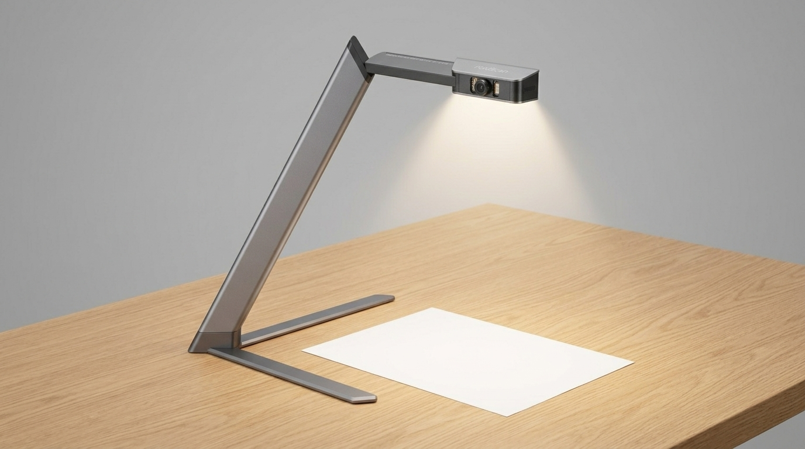

# FoldScan

**FoldScan is a USB-powered, foldable ESP32-S3 document-capture stand that stores evenly illuminated page photos offline and turns them into searchable PDFs through a private local desktop app.**



## Overview

FoldScan is an open-hardware path from paper to portable files without a cloud scanner account. A camera head folds over an A4/US-Letter work area, controllable LEDs reduce shadows, and a physical button captures pages to removable storage. A local Windows/macOS/Linux companion imports captures, corrects perspective and lighting, optionally runs offline OCR, organizes multi-page sessions, and exports images or PDF/PDF-A candidates.

The first prototype uses a Seeed Studio XIAO ESP32S3 Sense module as the camera/controller and a small custom low-voltage carrier for the capture button, status indication, controlled illumination, test points, and mechanical connections. The camera module is a candidate, not a promise of archival image quality; the optical evaluation milestone can change it before the custom PCB is finalized.

## Motivation

Phone scanning works, but it requires repeatedly positioning a phone and can produce inconsistent framing or hand shadows. Commercial overhead scanners are expensive and often depend on proprietary software. FoldScan aims for a repeatable desk workflow that one person can build, understand, repair, and use offline.

## Target users

- Students and home-office users digitizing notes, worksheets, receipts, and correspondence.
- Makers archiving workshop notebooks, labels, and paper references.
- Families organizing non-sensitive household paperwork locally.
- Open-hardware builders who want a reproducible camera/lighting/mechanical platform.

FoldScan is **not** a forensic, archival, legal-evidence, identity-document verification, accessibility, or preservation-grade scanner.

## Concrete use cases

1. Unfold the arm, connect a USB 5 V supply, and place a page against the alignment guides.
2. Start a capture session from the button or local companion.
3. Capture multiple pages; files remain on removable storage if the companion is absent.
4. Connect over USB or an explicitly enabled local Wi-Fi link.
5. Review thumbnails, rotate/reorder pages, correct perspective and illumination, and approve OCR.
6. Export original images, processed images, a PDF, and a versioned session manifest.

## MVP

- Stable foldable stand for A4 and US-Letter pages with replaceable alignment guides.
- Physical capture button, status indication, and dimmable low-voltage illumination.
- Offline capture queue on microSD with checksummed session manifests.
- USB import as the baseline; opt-in LAN transfer if it proves reliable and secure.
- Local desktop app for review, crop/perspective correction, page ordering, offline OCR, search, and PDF export.
- Reproducible firmware, editable KiCad sources, schematic-backed BOM, enclosure/arm source files, bring-up instructions, and fabrication outputs.

## Non-goals

- Cloud accounts, remote viewing, automatic upload, or subscription services.
- Autonomous capture of books at high speed or automatic page turning.
- Destructive book scanning, A2 capture, calibrated color reproduction, or guaranteed archival output.
- On-device OCR on the ESP32-S3 for the MVP.
- Battery charging, mains wiring, medical/legal claims, or unattended security monitoring.
- Calling a physical prototype tested before real bench evidence exists.

## Hardware outline

- **Controller/camera candidate:** Seeed Studio XIAO ESP32S3 Sense module; camera performance and exact module revision must be verified from manufacturer documentation and bench captures.
- **Interfaces:** camera, microSD, momentary capture button, status LED, PWM illumination control, USB, and optional local Wi-Fi.
- **Power:** externally certified USB 5 V SELV supply only; no battery or mains circuitry.
- **Mechanics:** weighted or clamped base, folding arm, camera head, replaceable page guides, and glare-aware LED diffusers. Mechanical files will use an editable CAD format and export printable STLs/STEP where practical.
- **Companion target:** local-first Tauri desktop app for Windows 10/11, macOS, and Linux; Rust processing core with OpenCV/Tesseract-class backends evaluated behind interfaces.
- **Planning cost target:** USD 50–75 for electronics, ordinary printed/mechanical parts, fasteners, cable, and suitable certified USB supply. This is a budget envelope, not a live quote; every candidate must be repriced and checked for availability before ordering.

## Editable-source commitment

The planned hardware source tree will contain real editable KiCad files:

- `hardware/kicad/foldscan.kicad_pro`
- `hardware/kicad/foldscan.kicad_sch`
- `hardware/kicad/foldscan.kicad_pcb`

Rendered images and PDFs may supplement these files but never replace them. Final manufacturer and MPN data belongs in **KiCad schematic symbol properties** as the source of truth and is exported to `bom/bom.csv`. The current preliminary CSV is planning input only.

## Privacy, permissions, and storage

- Captures remain on the device/removable media and the user's chosen local folders by default.
- No account, analytics, telemetry, or internet connection is required for core operation.
- Wi-Fi is disabled until explicitly provisioned; the baseline import path is USB/removable media.
- The desktop app asks only for selected-folder/file access. Camera and microphone permissions are not required on the host.
- Offline OCR is opt-in per import/profile and its text index stays local.
- Export and deletion are explicit; originals are preserved unless the user chooses otherwise.
- Session export includes a documented JSON manifest so users can leave the app.

## Safety limits

FoldScan is a low-voltage indoor prototype. Use only a certified, current-limited USB 5 V SELV supply. The project contains no mains input, battery charger, UV source, laser, high-power lamp, or safety-critical function. Illumination temperature, cable strain relief, hinge pinch points, stand stability, and surface temperatures must be measured during bring-up. Do not leave an unvalidated prototype powered unattended.

## Accessibility expectations

The companion must support keyboard-only operation, visible focus, scalable text, screen-reader names, non-color-only status, reduced-motion behavior, and high-contrast themes. Device status uses both distinct blink patterns and app text. Physical controls should be identifiable by touch and operable one-handed where the mechanics allow.

## Status and milestones

**Current status: architecture/documentation gate in progress; physical gate open.** ADR 0001 identifies the exact candidate bundle and blocks camera/PCB freeze because no physically identified sensor/lens, stand, raw optical corpus, current trace, or thermal measurement exists. The repository still has no KiCad project, schematic, PCB, validated schematic-derived BOM, firmware/app build, fabrication package, enclosure, or physical test evidence. See [`hardware/optical-spike/`](hardware/optical-spike/) for the reproducible bench procedure and honest evidence ledger.

1. Requirements, optical feasibility, architecture, and safety review.
2. Datasheet-backed component selection and editable KiCad schematic/BOM.
3. Carrier PCB layout, ERC/DRC, firmware capture path, and host protocol.
4. Companion import/processing/export workflow.
5. Integrated assembly, measured bring-up, optical test corpus, and troubleshooting.
6. Fabrication/release archive after evidence is complete.

See [PLAN.md](PLAN.md), [hardware/requirements.md](hardware/requirements.md), and the [issue backlog](https://github.com/rwrife/foldscan/issues).

## Development quickstart

The repository currently contains specifications, not executable projects:

```text
git clone https://github.com/rwrife/foldscan.git
cd foldscan
```

Planned toolchain:

- KiCad 9 or later for editable schematic/PCB work and ERC/DRC.
- ESP-IDF with a pinned toolchain/container for firmware.
- Rust, Node.js, and Tauri prerequisites for the desktop companion.
- OpenCV-compatible processing and offline OCR backends selected after license/quality evaluation.
- A parametric CAD toolchain selected during the mechanical milestone.

Exact bootstrap, build, test, flash, and packaging commands will be committed with their respective project skeletons; this README will not pretend they work before they exist.

## Licensing

Planned licensing is CERN-OHL-S-2.0 for hardware design files, Apache-2.0 or MIT-compatible licensing for firmware/app code, and CC BY-SA 4.0 for documentation/mechanical documentation where appropriate. The initial repository includes an MIT license for the scaffold; the licensing milestone will add per-directory notices before a hardware release.
